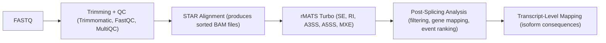

#  Splicing-Analysis  
A Modular RNA-seq Alternative Splicing Pipeline 

This repository provides a **modular**, and **reproducible** pipeline for performing alternative splicing analysis on RNA-seq data using **rMATS-turbo**, followed by **post-processing**, **gene annotation**, and **transcript-level interpretation**.

This workflow was originally developed for the splicing analysis of multiple viral infection models in *Macaca mulatta* (rhesus macaque), but the scripts can adapted to *any species or dataset.

---
#  Features

### End-to-end RNA-seq splicing pipeline
1. Download raw FASTQ data  
2. Perform trimming + QC  
3. Build STAR index  
4. Align reads (Pair-Ended (PE) or Single-Ended (SE))  
5. Run rMATS for differential splicing  
6. Post-process events (filter, annotate, rank)  
7. Map events to transcript-level consequences  

### HPC-friendly (SLURM)
- All steps come with ready-to-run **SLURM scripts**  
- Modular design → you can run steps independently  
- Works with any genome FASTA + GTF  , just need to plug the reference genome file and the appropriate path

### downstream analysis tools
- Filter significant SE/RI/A5SS/A3SS/MXE events  
- Map Ensembl IDs → gene symbols  
- Rank genes by splicing burden  
- Summarize transcript-level impact  
 
---
# Pipeline Overview



---
# Quick start guide

### 1️⃣ Download FASTQ Files
Edit your SRA accession list inside:

```
scripts/download_sra.sh
```

Run:
```bash
sbatch scripts/download_sra.sh
```
**Outputs →** `data/raw/`

### 2️⃣ Trim Reads + Run QC
Run:
```bash
sbatch scripts/trim_qc.sh
```

This script performs:
- Trimmomatic trimming  
- FastQC on raw + trimmed reads  
- (Optional) MultiQC summary  

**Outputs →**
- `data/trimmed/`
- `data/qc/`

### 3️⃣ Determine Read Length
Accurate read length is required for STAR and rMATS.

Run:
```bash
sbatch scripts/readLength.sh
sbatch scripts/readLengthMode.sh
```
Use the **mode read length** reported.

### 4️⃣ Build STAR Genome Index
Place reference files in `reference/`:

```
reference/genome.fasta
reference/annotation.gtf
```

Then run:
```bash
sbatch scripts/build_star_index.sh
```

**Outputs →** `reference/star_index/`

### 5️⃣ Align Reads (PE or SE)

**Paired-end alignment:**
```bash
sbatch scripts/run_star_PE.sh
```

**Single-end alignment:**
```bash
sbatch scripts/align_star_SE.sh
```

**Outputs →** sorted BAM files in `data/bam/`

### 6️⃣ Define Experimental Groups for rMATS
Create two text files listing BAMs:

```
baseline.txt
peak.txt
```
(One BAM per line or comma-separated depending on script, I got stuck on checking for bugs for an hour+ because of this smh.)

### 7️⃣ Run rMATS
Run:
```bash
sbatch scripts/rMATS_run.sh
```

**Outputs →**
```
rmats_out/
    ├── SE.MATS.JCEC.txt
    ├── RI.MATS.JCEC.txt
    ├── A5SS.MATS.JCEC.txt
    ├── A3SS.MATS.JCEC.txt
    └── MXE.MATS.JCEC.txt
```

### 8️⃣ Post-Splicing Analysis (Python Tools)

#### 8.1 Filter Events
```bash
python post-splicing-analysis/filter_rmats_events.py \
  --input rmats_out/SE.MATS.JCEC.txt \
  --fdr 0.05 \
  --delta_psi 0.1 \
  --output SE.filtered.tsv
```
Applies:
- FDR threshold  
- |ΔPSI| threshold  
- Optional read filters  

#### 8.2 Map Gene Names from GTF
```bash
python post-splicing-analysis/gene_name_map.py \
  --input SE.filtered.tsv \
  --gtf reference/annotation.gtf \
  --output SE.filtered.named.tsv
```

Adds:
- `gene_symbol`
- `gene_description` (if available)

#### 8.3 Rank Genes by Number of Splicing Events
```bash
python post-splicing-analysis/rank_genes_by_event_count.py \
  --input SE.filtered.named.tsv \
  --output gene_splicing_rank.tsv
```

Outputs:
- Genes sorted by splicing burden  
- Useful for identifying key splicing-regulated genes  

### 9️⃣ Transcript-Level Impact Analysis
Scripts in `transcripts-mapping/` allow you to:

- Map exon-level events to transcript annotations  
- Identify isoform gain/loss  
- Detect events affecting:
  - CDS
  - 5′ UTR
  - 3′ UTR
  - Internal exons  
- Understand functional impact:
  - Isoform switching  
  - Coding sequence disruptions  
  - Alternative protein generation  

---
# Requirments

### Core Tools
- STAR ≥ 2.7  
- rMATS-turbo ≥ 4.1.2  
- Trimmomatic ≥ 0.39  
- FastQC ≥ 0.11.9  
- MultiQC  
- samtools  
- Python ≥ 3.8  
for Python dependencies nothing crazy just pandas, numpy etc..

---
# Contributions
Contributions, improvements, and suggestions are welcome!

To contribute:
Open an Issue, Submit a Pull Request, Request a new feature ! Looking forward to you bioinformaticians feedback !

Cheers.


